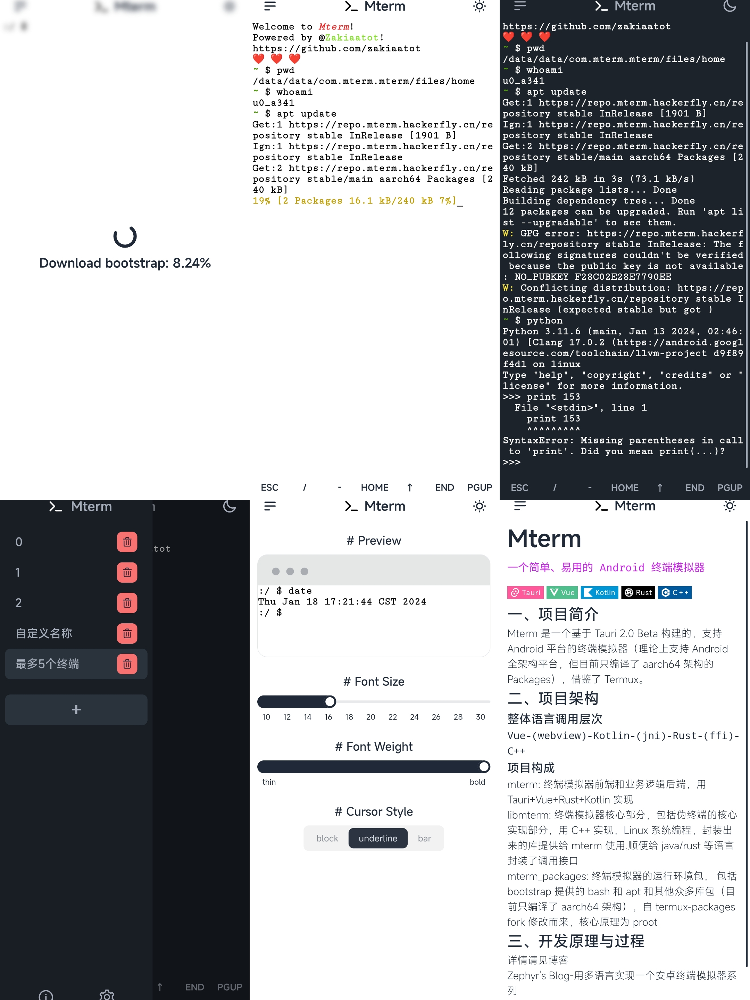

# Mterm

    

## 一、项目简介

Mterm 是一个基于 [Tauri 2.0 Beta](https://beta.tauri.app/) 构建的，支持 Android 平台的终端模拟器（理论上支持 Android 全架构平台，但目前只编译了 aarch64 架构的 Packages），借鉴了 [Termux](https://github.com/termux/termux-app)。

## 二、项目架构

### 整体语言调用层次

`Vue-(webview)-Kotlin-(jni)-Rust-(ffi)-C++`

### 项目构成

- [mterm](https://github.com/zakiaatot/mterm): 终端模拟器前端和业务逻辑后端，用 Tauri+Vue+Rust+Kotlin 实现

- [libmterm](https://github.com/zakiaatot/libmterm): 终端模拟器核心部分，包括伪终端的核心实现部分，用 C++ 实现，Linux 系统编程，封装出来的库提供给 mterm 使用,顺便给 java/rust 等语言封装了调用接口

- [mterm_packages](https://github.com/zakiaatot/mterm_packages): 终端模拟器的运行环境包，
  包括 bootstrap 提供的 bash 和 apt 和其他众多库包（目前只编译了 aarch64 架构），自 [termux-packages](https://github.com/termux/termux-packages) fork 修改而来，核心原理为 proot

## 三、开发原理与过程

详情请见博客
[Zephyr's Blog-用多语言实现一个安卓终端模拟器系列](https://blog.hackerfly.cn/categories/Project/Mterm/)

## 四、产品展示

## 五、产品下载

至 Github Release 页面下载

## 六、其他问题

有 Bug 或什么不懂的地方或者您有更好的建议，请随时提出 issue
